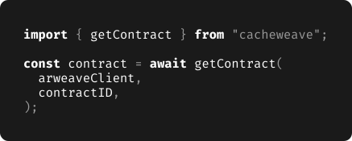

  

## Usage

> `getData` is identical to `arweave.transactions.getData`, except it uses caching whne run in the browser.

> `getContract` is identical to `smartweave.readContract`, except it uses caching when run in the browser.
